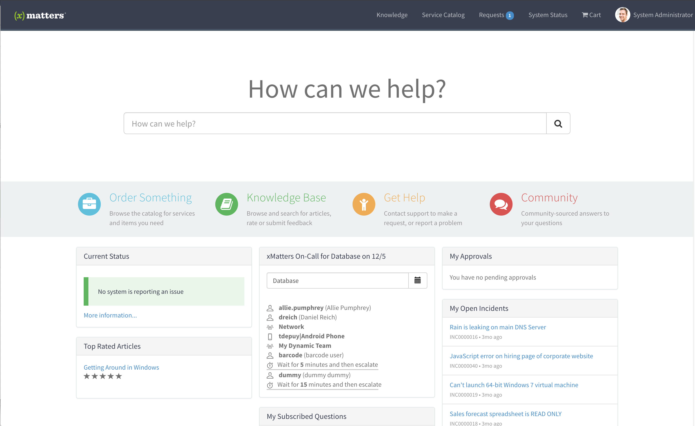
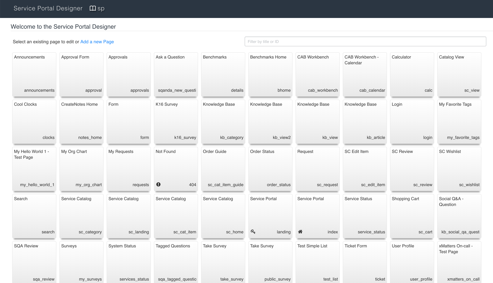
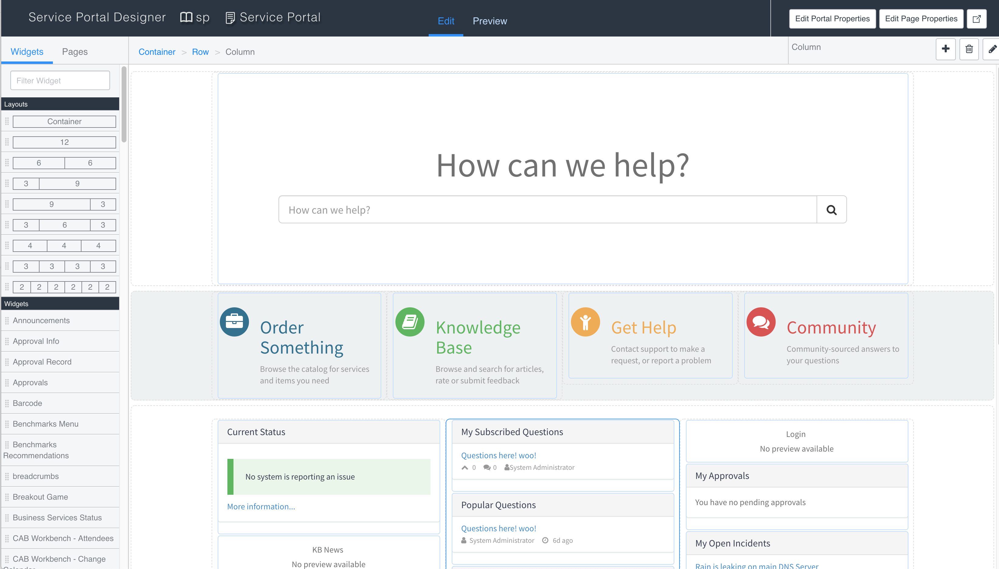
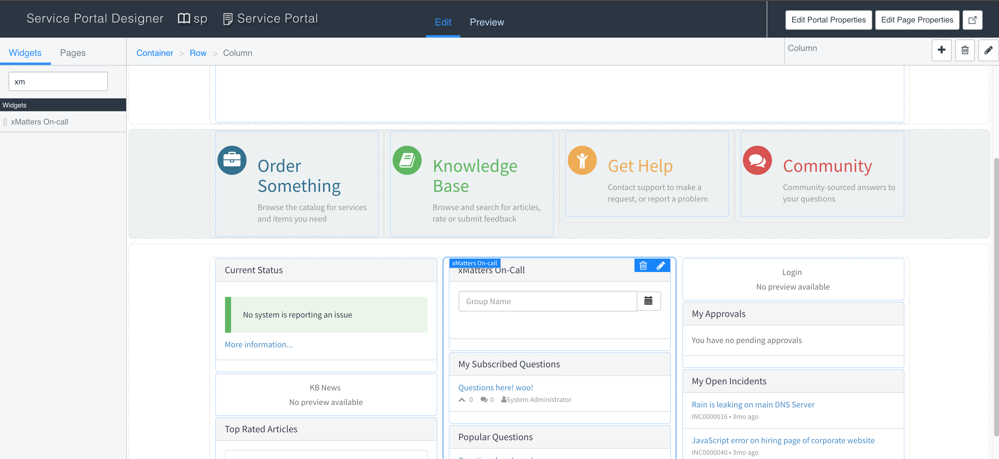
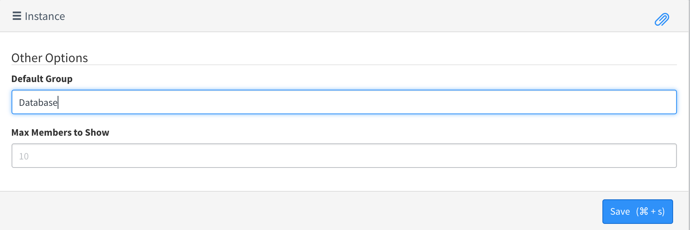
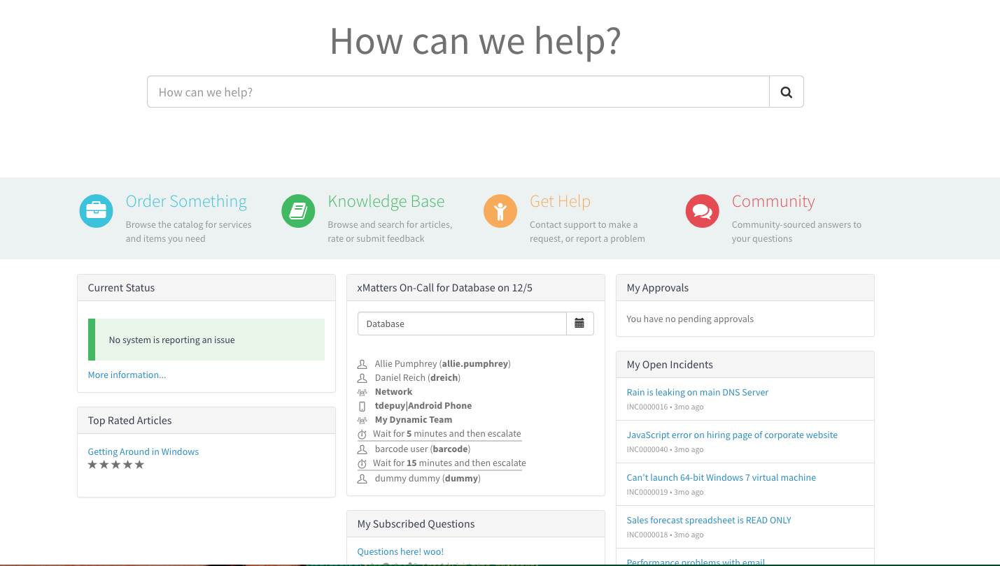

# ServiceNow Service Portal Widget for xMatters On-call Schedules
ServiceNow's [Service Portal](https://docs.servicenow.com/bundle/london-servicenow-platform/page/build/service-portal/concept/c_ServicePortal.html) is a framework for building self service pages for easy and quick access to the full functionality of the ServiceNow platform in one easy to manage space. This widget shows the on-call schedule for the current day for the default group, but also has a calendar button to select the day to view as well as a text box to change the group displayed. 

<kbd>
  
</kbd>

<kbd>
  
</kbd>

# Pre-Requisites
* 5.1.2+ of ServiceNow integration, available in the store [here](https://store.servicenow.com/sn_appstore_store.do#!/store/application/5950d7444f2231000e9fa88ca310c78c)
* The [Service Portal for Enterprise Service Management](https://docs.servicenow.com/bundle/kingston-servicenow-platform/page/build/service-portal/concept/activate-service-portal.html) plugin must be enabled.
* xMatters account - If you don't have one, [get one](https://www.xmatters.com)!

# Files
* [xm-on-call-widget.xml](xm-on-call-widget.xml) - Update set for loading into ServiceNow. This contains all the code needed to use the widget. 

# How it works
The widget uses the default group and the current time to retrieve the on-call information for that group. This allows multiple widgets to be used to show the current on-call information for different groups in the same page. A calendar button allows for selecting a different date to show the on-call. There is no time component as time pickers are big and hard to do. Feel free to create a pull request if you find a good way to add a time picker. 

# Installation

**Note**: This requires the xMatters integration to be installed and configured. The back end code uses the `xMattersDataHelper` script include to make the API call into xMatters and authenticates with the credentials stored in the configuration page. 

First, upload the update set. 

1. Navigate to **Retrieved Update Sets** and click **Import Update Set from XML**. 
2. Find the [xm-on-call-widget.xml](xm-on-call-widget.xml) file and click Upload. Click **Preview Update Set**, then **Commit Update Set**

# Configuration

Next, find a good Service Portal page to add this widget to by navigating to **Service Portal** > **Service Portal Configuration**. Then click on **Designer** to open the Service Portal Page Designer. 

<kbd>
  
</kbd>

Select the page to open in the designer and scroll to where the xMatters Widget should go.

<kbd>
  
</kbd>

In the Widget filter, enter xMatters and drag the widget to the page, then click the pencil icon to configure the default settings. 

<kbd>
  
</kbd>

Enter the name of a group to display on page load:

<kbd>
  
</kbd>

That's it! Repeat for any other pages or default groups. 

# Testing
Navigate to the Service Portal Page the widget was added to, either through the Service Portal menu item, or entering the url `https://instance-name.service-now.com/service-portal-page-name` and verify the on-call information is displayed for the group. 

<kbd>
  
</kbd>

# Troubleshooting

The first place to look for any errors is the browser console as this will have any errors rendering the widget or sending data to the server. Otherwise the System Log will have server side information. 
